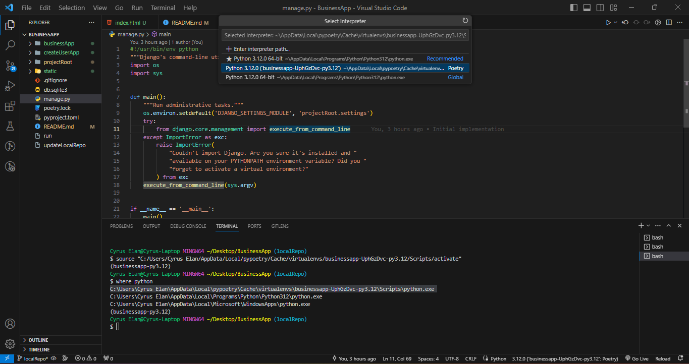

# Christian Cleofas First project for own business

To setup this project you need to install the poetry package management using this command

For windows 10 higher

-- pip install poetry 

For ubuntu 
-- sudo pip install poetry (or without sudo)

Next you need to type this command one by one on your terminal

1. poetry shell
- after you type the command, you need this type on you terminal (for windows = "where python" and for ubuntu = "which python")

- then copy this (example: C:\Users\Cyrus Elan\AppData\Local\pypoetry\Cache\virtualenvs\businessapp-UphGzDvc-py3.12\Scripts\python.exe)
then paste to select interpreter on your visual studio code to activate the virtualenv. see image below..

2. poetry install
